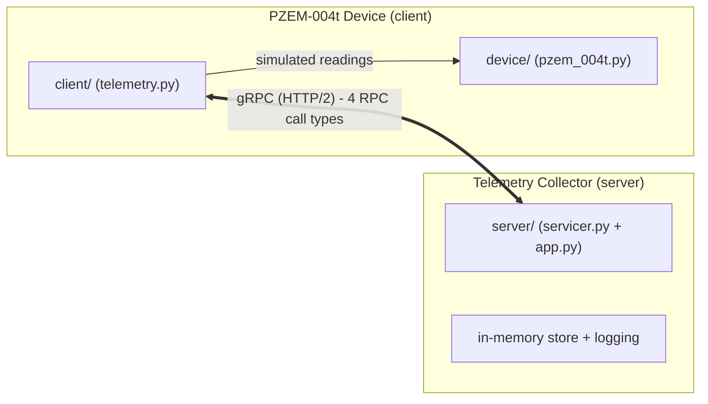

# Python gRPC — PZEM-004t Telemetry Demo

A minimal end-to-end demonstration of **gRPC in Python** using the async
`grpc.aio` API. A simulated electrical device reads live data from a
**PZEM-004t** AC power meter (voltage, current, active power, energy,
frequency, power factor) and pushes it over gRPC to a collector server.

## Architecture



The `pzem_004t.proto` definition lives in `src/python_grpc/proto/`. Stubs are
generated from it with `grpcio-tools` and committed alongside the proto so the
demo runs out of the box.

### The four gRPC call types

| RPC | Type | Direction | Meaning |
|---|---|---|---|
| `ReportReading` | unary-unary | client → server | device reports one reading, gets an `Ack` |
| `ReportReadings` | client-streaming | client ⇉ server | batch upload, server replies with a `BatchSummary` |
| `Subscribe` | server-streaming | server ⇉ client | collector streams live readings for a device |
| `StreamTelemetry` | bidi-streaming | client ⇄ server | continuous two-way exchange, ack per reading |

### File layout

```
src/python_grpc/
  proto/                       # protobuf schema + generated stubs
    pzem_004t.proto            # schema (authoritative)
    pzem_004t_pb2.py           # generated message classes
    pzem_004t_pb2_grpc.py      # generated service stubs
  device/
    pzem_004t.py               # PZEM004TDevice simulator
  client/
    telemetry.py               # gRPC client logic (4 RPC runners)
    __main__.py                # CLI entry point
  server/
    servicer.py                # DeviceTelemetryServicer (all 4 RPCs)
    app.py                     # serve()/main() bootstrap
    __main__.py                # CLI entry point
scripts/
  gen_proto.py                 # regenerate stubs from the proto
tests/
  test_device.py               # simulator unit tests
  test_telemetry.py            # end-to-end RPC tests (local server)
```

## Requirements

- Python >= 3.13
- [Poetry](https://python-poetry.org/) (project is Poetry-managed)

## Setup

```bash
poetry install
```

## Run the demo

Terminal 1 — start the collector server:

```bash
poetry run python -m python_grpc.server
```

Terminal 2 — run the device simulation (exercises all 4 RPC types):

```bash
poetry run python -m python_grpc.client
```

Useful client flags:

```bash
poetry run python -m python_grpc.client \
  --target localhost:50051 \
  --device-id PZEM-004T-0002 \
  --count 10 \
  --rpc unary client-stream server-stream bidi
```

## Tests

```bash
poetry run python -m unittest discover -s tests -v
```

Tests spin up a real local `grpc.aio` server on an ephemeral port and verify
every RPC type end-to-end.

## Regenerating stubs

After editing `pzem_004t.proto`:

```bash
poetry run python scripts/gen_proto.py
```

## Simulated reading fields

| Field | Unit | Nominal |
|---|---|---|
| `voltage` | V | 230 |
| `current` | A | 2.5 |
| `active_power` | W | ≈ V × I × PF |
| `energy` | kWh | monotonically increasing |
| `frequency` | Hz | 50 |
| `power_factor` | 0–1 | 0.98 |
