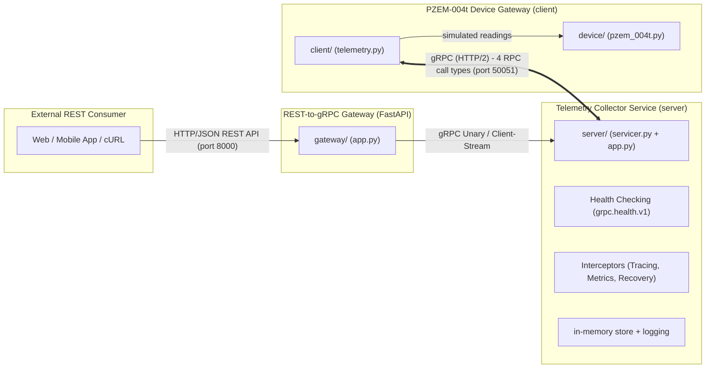

# Python gRPC — PZEM-004t Industry-Grade Microservices & Gateway Prototype

An end-to-end demonstration of **industry-grade gRPC in Python** using the async
`grpc.aio` API. A simulated electrical device reads live data from a
**PZEM-004t** AC power meter (voltage, current, active power, energy,
frequency, power factor) and pushes it over gRPC to a collector server, with an
optional **FastAPI REST-to-gRPC Gateway** allowing external REST API consumers to
interact with the gRPC microservice.

## Architecture



### Industry-Grade Capabilities Implemented

- **Dual-App Separation**: Telemetry Collector (Server) and IoT Gateway (Client) operate as decoupled microservice applications.
- **gRPC Interceptors**:
  - **Client-Side**: Injects distributed tracing headers (`x-request-id`) and `x-client-version`.
  - **Server-Side**: Performance metrics logging (RPC duration, peer IP, status code) and unhandled exception recovery translating errors safely into gRPC status codes.
- **Official Health Checking (`grpc.health.v1`)**: Exposes standard gRPC health checks for Kubernetes liveness/readiness probes and load balancers.
- **Connection Resilience**: Configured HTTP/2 keepalive pings (`grpc.keepalive_time_ms`), request timeouts (deadlines), and auto-reconnects.
- **REST-to-gRPC Gateway**: FastAPI application translating external HTTP/JSON REST requests into strongly-typed gRPC calls.
- **Container Orchestration**: Production `Dockerfile` and `docker-compose.yml` for multi-container deployment.

### The four gRPC call types

| RPC | Type | Direction | Meaning |
|---|---|---|---|
| `ReportReading` | unary-unary | client → server | device reports one reading, gets an `Ack` |
| `ReportReadings` | client-streaming | client ⇉ server | batch upload, server replies with a `BatchSummary` |
| `Subscribe` | server-streaming | server ⇉ client | collector streams live readings for a device |
| `StreamTelemetry` | bidi-streaming | client ⇄ server | continuous two-way exchange, ack per reading |

### File layout

```
src/python_grpc/
  proto/                       # protobuf schema + generated stubs
    pzem_004t.proto            # schema (authoritative)
    pzem_004t_pb2.py           # generated message classes
    pzem_004t_pb2_grpc.py      # generated service stubs
  common/                      # shared enterprise gRPC infrastructure
    config.py                  # HTTP/2 keepalive & channel options
    interceptors.py            # client & server interceptors (tracing, metrics)
  device/
    pzem_004t.py               # PZEM004TDevice simulator
  client/
    telemetry.py               # resilient gRPC client with health check & interceptor
    __main__.py                # CLI entry point
  server/
    servicer.py                # DeviceTelemetryServicer (all 4 RPCs)
    app.py                     # server bootstrap with grpc.health.v1 & interceptor
    __main__.py                # CLI entry point
  gateway/
    app.py                     # FastAPI REST-to-gRPC gateway
    __main__.py                # CLI entry point
scripts/
  gen_proto.py                 # regenerate stubs from the proto
tests/
  test_device.py               # simulator unit tests
  test_telemetry.py            # end-to-end RPC tests (local server)
  test_health_and_interceptors.py # gRPC health & interceptor integration tests
  test_gateway.py              # FastAPI REST-to-gRPC gateway integration tests
Dockerfile                     # multi-app container build
docker-compose.yml             # multi-service orchestration
```

## Requirements

- Python >= 3.13
- [Poetry](https://python-poetry.org/) (project is Poetry-managed)
- Docker & Docker Compose (optional, for containerized run)

## Setup

```bash
poetry install
```

## Running the Applications

### Option A: Running via Poetry locally

#### 1. Start the Telemetry Collector Server (Terminal 1)
```bash
poetry run python -m python_grpc.server --host 0.0.0.0 --port 50051
```

#### 2. Run the IoT Device Gateway Client (Terminal 2)
```bash
poetry run python -m python_grpc.client --target localhost:50051 --device-id PZEM-004T-0001 --count 5
```

#### 3. Start the REST-to-gRPC Gateway (Terminal 3, optional)
```bash
poetry run python -m python_grpc.gateway --host 0.0.0.0 --port 8000 --grpc-target localhost:50051
```
Open your browser at `http://localhost:8000/docs` to test Swagger UI or send a cURL request:
```bash
curl -X POST "http://localhost:8000/api/v1/telemetry" \
  -H "Content-Type: application/json" \
  -d '{"device_id": "REST-01", "voltage": 230.2, "current": 2.1, "active_power": 483.4, "energy": 1.2, "frequency": 50.0, "power_factor": 0.99}'
```

### Option B: Running with Docker Compose
Spin up the entire microservice topology:
```bash
docker compose up --build
```

## Running Tests

```bash
poetry run pytest -v --cov=python_grpc
```

Tests run 17 automated integration and unit tests covering:
- Sensor physics and energy accumulation ([`tests/test_device.py`](tests/test_device.py))
- All 4 gRPC streaming patterns ([`tests/test_telemetry.py`](tests/test_telemetry.py))
- Cross-host multi-client pub/sub broadcasting & disconnect resilience ([`tests/test_cross_host.py`](tests/test_cross_host.py))
- Standard gRPC Health Checking (`grpc.health.v1`) & Interceptors ([`tests/test_health_and_interceptors.py`](tests/test_health_and_interceptors.py))
- FastAPI REST-to-gRPC unary and batch forwarding ([`tests/test_gateway.py`](tests/test_gateway.py))

## Type Checking

Pyrefly runs in `strict` mode against the entire codebase (`preset = "strict"` in `pyproject.toml`):
```bash
poetry run pyrefly check
```

## CI/CD Deployment with GitHub Actions

The repository includes preconfigured GitHub Actions workflows in `.github/workflows/`:

1. **Continuous Integration (`.github/workflows/ci.yml`)**:
   - Triggers on PRs and pushes to `main`.
   - Runs Python 3.13 with Poetry dependency caching.
   - Verifies Protobuf stub freshness (fails if generated code drifted from `pzem_004t.proto`).
   - Runs strict Pyrefly type checking.
   - Executes all 14 integration and unit tests.

2. **Manual Deployment to Target Server (`.github/workflows/deploy.yml`)**:
   - Strictly developer-triggered via GitHub Actions **"Run workflow"** (`workflow_dispatch`).
   - Supports parameter selection:
     - `environment`: `staging` or `production`.
     - `run_tests`: Boolean toggle to run or skip full test verification before deploy.
     - `deploy_tag`: Optional specific image tag or commit SHA.
   - **Job 1 (verify-tests)**: Runs strict type checks and the 14 automated tests (conditional).
   - **Job 2 (build-and-push)**: Builds multi-architecture images (`linux/amd64`, `linux/arm64`) and pushes to **GHCR** (`ghcr.io/farrelad/python-grpc`).
   - **Job 3 (deploy-remote)**: Connects via SSH to the remote host, pulls pre-built images with `IMAGE_NAME=ghcr.io/farrelad/python-grpc docker compose pull`, performs a zero-downtime container recreation with `docker compose up -d`, and verifies service health with a live HTTP `/health` probe.

### Target Server GitHub Secrets
To deploy to a remote server, configure these in **Settings -> Secrets and variables -> Actions**:
- `SERVER_HOST`: Remote server IP address or hostname
- `SERVER_USER`: Remote SSH username (e.g. `ubuntu`)
- `SERVER_SSH_KEY`: Private SSH key authorized on the server
- `SERVER_DEPLOY_PATH`: Target directory on the server containing `docker-compose.yml` (default: `/opt/python-grpc`)
- `SERVER_PORT`: (Optional) SSH port, defaults to 22
